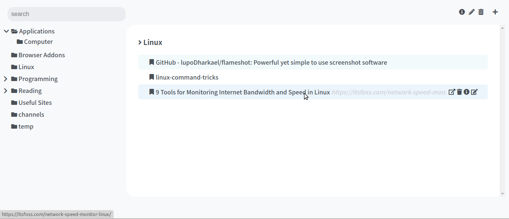
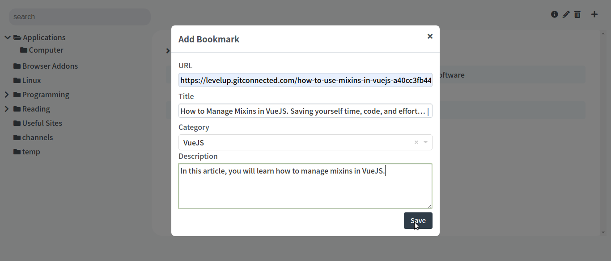

# ProdUtils

This project is a set of apps that help you to be more productive.

### Bookmark App







It has a clear separation: use Vue, Yarn, and Webpack to handle all frontend logic and assets bundling,
and use Django with Django REST framework to manage the Data Models, Web API, and serve static files.


### Includes

* Django
* Django REST framework
* Django Whitenoise, CDN Ready
* Vue CLI 3
* Vue Router
* Vuex
* Gunicorn*
* Configuration for Heroku Deployment


### Template Structure


| Location             |  Content                                   |
|----------------------|--------------------------------------------|
| `/backend`           | Django Project & Backend Config            |
| `/backend/api`       | Django App (`/api`)                        |
| `/src`               | Vue App .                                  |
| `/src/main.js`       | JS Application Entry Point                 |
| `/public/index.html` | Html Application Entry Point (`/`)         |
| `/public/static`     | Static Assets                              |
| `/dist/`             | Bundled Assets Output (generated at `yarn build`) |

## Prerequisites

Before getting started you should have the following installed and running:

- [X] Yarn - [instructions](https://yarnpkg.com/en/docs/install)
- [X] Vue CLI 3 - [instructions](https://cli.vuejs.org/guide/installation.html)
- [X] Python 3 - [instructions](https://wiki.python.org/moin/BeginnersGuide)
- [X] virtualenv

## Setup Template

```
$ git clone https://github.com/gtalarico/django-vue-template
$ cd django-vue-template
```

Setup
```
$ yarn install
$ virtualenv -p python3 env
$ source env/bin/activate
$ python manage.py migrate
```

## Running Development Servers

```
$ python manage.py runserver 8888
```

From another tab in the same directory:

```
$ yarn serve
```

The Vue application will be served from [`localhost:8080`](http://localhost:8080/) and the Django API
and static files will be served from [`localhost:8888`](http://localhost:8888/).

The dual dev server setup allows you to take advantage of
webpack's development server with hot module replacement.


## Deploy

* Set `ALLOWED_HOSTS` on [`backend.settings.prod`](/backend/settings/prod.py)

### Heroku Server

```
$ heroku apps:create django-vue-template-demo
$ heroku git:remote --app django-vue-template-demo
$ heroku buildpacks:add --index 1 heroku/nodejs
$ heroku buildpacks:add --index 2 heroku/python
$ heroku addons:create heroku-postgresql:hobby-dev
$ heroku config:set DJANGO_SETTINGS_MODULE=backend.settings.prod
$ heroku config:set DJANGO_SECRET_KEY='...(your django SECRET_KEY value)...'

$ git push heroku
```

Heroku's nodejs buildpack will handle install for all the dependencies from the [`package.json`](/package.json) file.
It will then trigger the `postinstall` command which calls `yarn build`.
This will create the bundled `dist` folder which will be served by whitenoise.

The python buildpack will detect the [`Pipfile`](/Pipfile) and install all the python dependencies.

The [`Procfile`](/Procfile) will run Django migrations and then launch Django'S app using gunicorn, as recommended by heroku.


## Static Assets

See `settings.dev` and [`vue.config.js`](/vue.config.js) for notes on static assets strategy.

This template implements the approach suggested by Whitenoise Django.
For more details see [WhiteNoise Documentation](http://whitenoise.evans.io/en/stable/django.html)

It uses Django Whitenoise to serve all static files and Vue bundled files at `/static/`.
While it might seem inefficient, the issue is immediately solved by adding a CDN
with Cloudfront or similar.
Use [`vue.config.js`](/vue.config.js) > `baseUrl` option to set point all your assets to the CDN,
and then set your CDN's origin back to your domains `/static` url.

Whitenoise will serve static files to your CDN once, but then those assets are cached
and served directly by the CDN.

This allows for an extremely simple setup without the need for a separate static server.

[Cloudfront Setup Wiki](https://github.com/gtalarico/django-vue-template/wiki/Setup-CDN-on-Cloud-Front)


### License
Anyone has the right to use this project in accordance with Islamic law and its values.